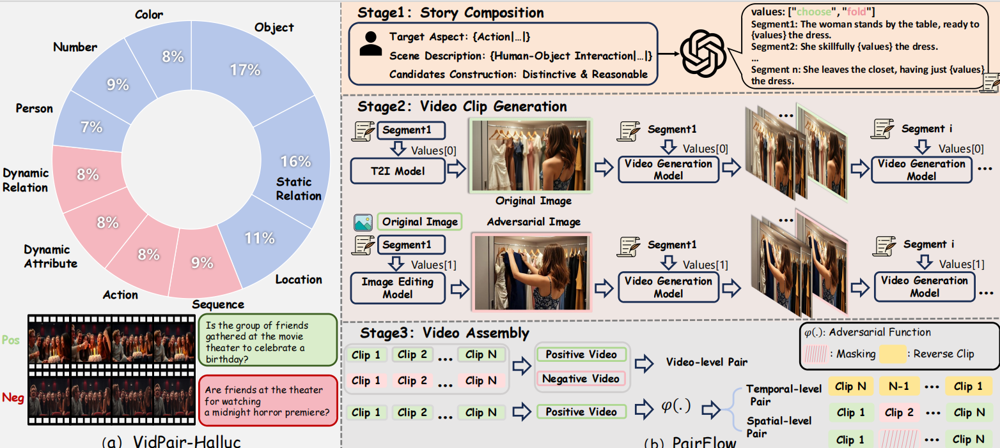

# NO PLACE TO HIDE: Benchmarking Video Hallucination with Background-Controlled Pairs

<p align="center">
  
</p>

## Abstract
We introduce **VidPair-Halluc**, a new benchmark for evaluating video hallucination in large video models (LVMs) under rigorous and controlled conditions. Unlike previous benchmarks that primarily rely on text-based perturbations or adversarial questions while neglecting the consistency of visual backgrounds, VidPair-Halluc features video pairs with highly similar backgrounds but distinctly different foreground semantics, enabling precise attribution of model errors to genuine hallucination rather than background variation. The benchmark is constructed through **PairFlow**, a pipeline that leverages recent advances in text-to-image and video generation to systematically compose stories, generate coherent video clips, and assemble them into adversarial pairs. Covering both spatial and temporal reasoning across ten semantic aspects, VidPair-Halluc comprises **1K** high-quality adversarial video pairs and **11K** spatio-temporal QA pairs with control over background and foreground variations. We evaluate mainstream LVMs on VidPair-Halluc, and our results show that current models still struggle with robust and fine-grained video understanding in adversarial settings.

## Files
- `story.json` — All story scripts and candidate values.
- `seg.json` — Segment-level metadata for video generation.
- `generate_seg_json.py` — Build `seg.json` from `story.json` + original/edited images.
- `process_data.py` — Process `raw_data/` to produce `story.json`, `id.txt`, and `processed_data/`.

## Quick Start
```bash
python process_data.py
python generate_seg_json.py
